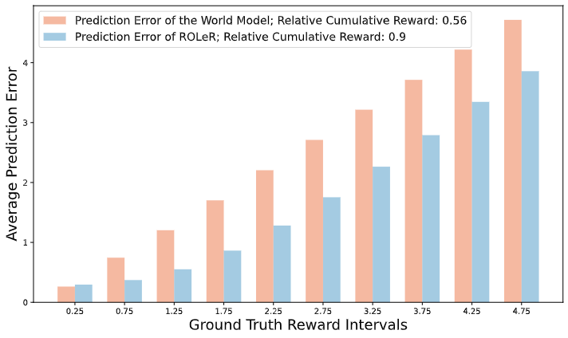

# ROLeR: Effective Reward Shaping in Offline Reinforcement Learning for Recommender Systems

This repository provides the official PyTorch implementation, reproduction and experiment logs for the paper titled "ROLeR: Effective Reward Shaping in Offline Reinforcement Learning for Recommender Systems." Within this paper, experiments are conducted on four RL environments: ```KuaiEnv-v0```, ```KuaiRand-v0```, ```CoatEnv-v0``` and ```YahooEnv-v0```, whose introduction can be found at [KuaiRec](https://kuairec.com/), [KuaiRand](https://kuairand.com/), [Coat](https://www.cs.cornell.edu/~schnabts/mnar/), and [Yahoo](https://dl.acm.org/doi/10.1145/1639714.1639717).

More details can be found in our [paper](https://arxiv.org/abs/2407.13163). The authors are Yi Zhang, Ruihong Qiu, Jiajun Liu, and Sen Wang.

<div style="text-align: center;">
    <figure>
        
        <figcaption style="font-size: 14px; color: #555;">The reward estimation error of a world model and ROLeR across different intervals. Our training-free reward shaping constantly outperforms that of the current world model, reaching a higher relative cumulative reward.</figcaption>
    </figure>
</div>


## Installation

1. Clone this repo and enter into the directory:

   ```shell
   git clone https://github.com/ArronDZhang/ROLeR.git && cd ROLeR
   ```

2. Here we offer three ways to create the same virtual environment as ours. You can choose whichever option is most convenient for you.

   a) with environments.yml [recommended]

   ```bash
   conda env create -f environment.yml
   conda activate roler
   ```

   b) with Docker [recommended]

   

   c) with requirements.txt

   ```shell
   conda create --name roler python=3.10 -y
   conda activate roler
   pip install -r requirements.txt
   ```

  Note: To avoid potential package conflicts, we choose to use a fixed version of [tianshou](https://github.com/thu-ml/tianshou). Thus, you do not need to manually install it.


## Dataset

1. Download the datasets used in our work:

   ```bash
   wget https://chongming.myds.me:61364/DORL/environments.tar.gz
   ```

   Or you can download them manually from [here](https://rec.ustc.edu.cn/share/9fe264f0-ae09-11ed-b9ef-ed1045d76757).

2. Uncompress the downloaded `environments.tar.gz` and put the files in ```ROLeR/```:

   ```bash
   tar -zxvf environments.tar.gz
   ```


## Reproduce

To reproduce the results, we have two main steps. In the first step, we train world models (DeepFM) to provide user and item embeddings for offline model-free RL methods, as well as uncertainty penalties (e.g., MOPO), entropy penalties (e.g., DORL), and reward models for offline model-based RL methods. In the second step, the recommendation policies are trained.

### Step 1: World Model Learning 

```bash
python run_worldModel_IPS.py --env KuaiEnv-v0 --seed 0 --cuda 0 --loss "pointneg" --message "DeepFM-IPS"
python run_linUCB.py --env KuaiEnv-v0 --num_leave_compute 4 --leave_threshold 0 --epoch 200 --seed 0 --cuda 0 --loss "pointneg" --message "UCB"
python run_epsilongreedy.py --env KuaiEnv-v0 --num_leave_compute 4 --leave_threshold 0 --epoch 200 --seed 0 --cuda 0 --loss "pointneg" --message "epsilon-greedy"
python run_worldModel_ensemble.py --env KuaiEnv-v0 --cuda 0 --epoch 5 --loss "pointneg" --message "pointneg"
```

Note: 

1) The above commands are exammplified with ```KuaiEnv-v0```. To train the world models for KuaiRand, Coat and Yahoo, you just need to change the argument of ```--env``` to ```KuaiRand-v0```, ```CoatEnv-v0``` and ```YahooEnv-v0```, respectively;

2) The arguments of  ```--message``` in the commands are hooks which serve as identifiers for algorithms to retrieve necessary elements in the next step (i.e., recommendation policy learning);

3) After running the commands, the results will be saved in ```ROLeR/saved_models/```.

### Step 2: Recommendation Policy Learning

In this subsection, we offer the commands of training the recommendation policies on each environment. Before we begin, please make sure that the programs in Step 1 are completed.

**KuaiEnv-v0**

```bash
## Model-free
python run_Policy_SQN.py --env KuaiEnv-v0 --seed 0 --cuda 0 --num_leave_compute 1 --leave_threshold 0 --which_tracker avg --reward_handle "cat" --window_size 3 --read_message "pointneg" --message "SQN"
python run_Policy_CRR.py --env KuaiEnv-v0 --seed 0 --cuda 0 --num_leave_compute 1 --leave_threshold 0 --which_tracker avg --reward_handle "cat" --window_size 3 --read_message "pointneg" --message "CRR"
python run_Policy_CQL.py --env KuaiEnv-v0 --seed 0 --cuda 0 --num_leave_compute 1 --leave_threshold 0 --which_tracker avg --reward_handle "cat" --num-quantiles 20 --min-q-weight 10 --window_size 3 --read_message "pointneg" --message "CQL"
python run_Policy_BCQ.py --env KuaiEnv-v0 --seed 0 --cuda 0 --num_leave_compute 1 --leave_threshold 0 --which_tracker avg --reward_handle "cat" --unlikely-action-threshold 0.6 --window_size 3 --read_message "pointneg" --message "BCQ"
## Model-based
python run_Policy_IPS.py --env KuaiEnv-v0 --seed 0 --cuda 0 --num_leave_compute 1 --leave_threshold 0 --which_tracker avg --reward_handle "cat" --lambda_variance 0 --lambda_entropy 0 --window_size 3 --read_message "DeepFM-IPS" --message "IPS"
python run_Policy_Main.py --env KuaiEnv-v0 --seed 0 --cuda 0 --num_leave_compute 1 --leave_threshold 0 --which_tracker avg --reward_handle "cat" --lambda_variance 0 --lambda_entropy 0 --window_size 3 --read_message "pointneg" --message "MBPO"
python run_Policy_Main.py --env KuaiEnv-v0 --seed 0 --cuda 0 --num_leave_compute 1 --leave_threshold 0 --which_tracker avg --reward_handle "cat" --lambda_variance 0.05 --lambda_entropy 0 --window_size 3 --read_message "pointneg" --message "MOPO"
python run_Policy_Main.py --env KuaiEnv-v0 --seed 0 --cuda 0 --num_leave_compute 1 --leave_threshold 0 --which_tracker avg --reward_handle "cat" --lambda_variance 0.05 --lambda_entropy 5 --window_size 3 --read_message "pointneg" --message "DORL"

## Our ROLeR
python run_Policy_Main.py --env KuaiEnv-v0 --seed 0 --cuda 1 --num_leave_compute 1 --leave_threshold 0 --which_tracker att --reward_handle "cat" --lambda_variance 0.05 --lambda_entropy 5 --window_size 3 --read_message "pointneg" --message "ROLeR" --remark std --scratch True --change_pred_reward True --change_var True --kr 30 --ku 30
```

**KuaiRand-v0**

```bash
## Model-free
python run_Policy_SQN.py --env KuaiRand-v0 --seed 0 --cuda 0 --num_leave_compute 1 --leave_threshold 0 --which_tracker avg --reward_handle "cat" --window_size 3 --read_message "pointneg" --message "SQN"
python run_Policy_CRR.py --env KuaiRand-v0 --seed 0 --cuda 0 --num_leave_compute 1 --leave_threshold 0 --which_tracker avg --reward_handle "cat" --window_size 3 --read_message "pointneg" --message "CRR"
python run_Policy_CQL.py --env KuaiRand-v0 --seed 0 --cuda 0 --num_leave_compute 1 --leave_threshold 0 --which_tracker avg --reward_handle "cat" --num-quantiles 20 --min-q-weight 10 --window_size 3 --read_message "pointneg" --message "CQL"
python run_Policy_BCQ.py --env KuaiRand-v0 --seed 0 --cuda 0 --num_leave_compute 1 --leave_threshold 0 --which_tracker avg --reward_handle "cat" --unlikely-action-threshold 0.6 --window_size 3 --read_message "pointneg" --message "BCQ"
## Model-based
python run_Policy_IPS.py --env KuaiRand-v0 --seed 0 --cuda 0 --num_leave_compute 1 --leave_threshold 0 --which_tracker avg --reward_handle "cat" --lambda_variance 0 --lambda_entropy 0 --window_size 3 --read_message "DeepFM-IPS" --message "IPS"
python run_Policy_Main.py --env KuaiRand-v0 --seed 0 --cuda 0 --num_leave_compute 1 --leave_threshold 0 --which_tracker avg --reward_handle "cat" --lambda_variance 0 --lambda_entropy 0 --window_size 3 --read_message "pointneg" --message "MBPO"
python run_Policy_Main.py --env KuaiRand-v0 --seed 0 --cuda 0 --num_leave_compute 1 --leave_threshold 0 --which_tracker avg --reward_handle "cat" --lambda_variance 0.01 --lambda_entropy 0 --window_size 3 --read_message "pointneg" --message "MOPO"
python run_Policy_Main.py --env KuaiRand-v0 --seed 0 --cuda 0 --num_leave_compute 1 --leave_threshold 0 --which_tracker avg --reward_handle "cat" --lambda_variance 0.01 --lambda_entropy 0.05 --window_size 3 --read_message "pointneg" --message "DORL"

## Our ROLeR
python run_Policy_Main.py --env KuaiRand-v0 --seed 0 --cuda 1 --num_leave_compute 1 --leave_threshold 0 --which_tracker avg --reward_handle "cat" --lambda_variance 0.01 --lambda_entropy 0.05  --window_size 3 --read_message "pointneg"  --message "ROLeR" --remark std --scratch True --change_pred_reward True --change_var True --kr 150 --ku 150 --uncertain_type II-weight-norm
```

**CoatEnv-v0**

```bash
## Model-free
python run_Policy_SQN.py --env CoatEnv-v0  --seed 0 --cuda 0 --num_leave_compute 1 --leave_threshold 0 --which_tracker avg --reward_handle "cat"  --window_size 3 --read_message "pointneg"  --message "SQN"
python run_Policy_CRR.py --env CoatEnv-v0  --seed 0 --cuda 0 --num_leave_compute 1 --leave_threshold 0 --which_tracker avg --reward_handle "cat"  --window_size 3 --read_message "pointneg"  --message "CRR"
python run_Policy_CQL.py --env CoatEnv-v0  --seed 0 --cuda 0 --num_leave_compute 1 --leave_threshold 0 --which_tracker avg --reward_handle "cat"  --num-quantiles 20 --min-q-weight 10 --window_size 3 --read_message "pointneg"  --message "CQL"
python run_Policy_BCQ.py --env CoatEnv-v0  --seed 0 --cuda 0 --num_leave_compute 1 --leave_threshold 0 --which_tracker avg --reward_handle "cat"  --unlikely-action-threshold 0.6 --window_size 3 --read_message "pointneg"  --message "BCQ"
## Model-based
python run_Policy_IPS.py --env CoatEnv-v0  --seed 0 --cuda 0 --num_leave_compute 1 --leave_threshold 0 --which_tracker avg --reward_handle "cat" --lambda_variance 0 --lambda_entropy 0    --window_size 3 --read_message "DeepFM-IPS"  --message "IPS"
python run_Policy_Main.py --env CoatEnv-v0  --seed 0 --cuda 0 --num_leave_compute 1 --leave_threshold 0 --which_tracker avg --reward_handle "cat" --lambda_variance 0 --lambda_entropy 0  --window_size 3 --read_message "pointneg"  --message "MBPO"
python run_Policy_Main.py --env CoatEnv-v0 --seed 0 --cuda 0  --num_leave_compute 1 --leave_threshold 0 --which_tracker avg --reward_handle "cat" --lambda_variance 0.02 --lambda_entropy 0 --window_size 3 --read_message "pointneg"  --message "MOPO"
python run_Policy_Main.py --env CoatEnv-v0 --seed 0 --cuda 0  --num_leave_compute 1 --leave_threshold 0 --which_tracker avg --reward_handle "cat" --lambda_variance 0.005 --lambda_entropy 1 --window_size 3 --read_message "pointneg"  --message "DORL"

## Our ROLeR
python run_Policy_Main.py --env CoatEnv-v0 --seed 0 --cuda 1 --num_leave_compute 1 --leave_threshold 0 --which_tracker att --reward_handle "cat" --lambda_variance 0.005 --lambda_entropy 1  --window_size 3 --read_message "pointneg"  --message "ROLeR" --scratch True --change_pred_reward True --change_var True --kr 15 --ku 15 --remark std --uncertain_type II-weight-norm
```

**YahooEnv-v0**

```bash
## Model-free
python run_Policy_SQN.py --env YahooEnv-v0 --seed 0 --cuda 0 --num_leave_compute 1 --leave_threshold 0 --which_tracker avg --reward_handle "cat" --window_size 3 --read_message "pointneg" --message "SQN"
python run_Policy_CRR.py --env YahooEnv-v0 --seed 0 --cuda 0 --num_leave_compute 1 --leave_threshold 0 --which_tracker avg --reward_handle "cat" --window_size 3 --read_message "pointneg" --message "CRR"
python run_Policy_CQL.py --env YahooEnv-v0 --seed 0 --cuda 0 --num_leave_compute 1 --leave_threshold 0 --which_tracker avg --reward_handle "cat" --num-quantiles 10 --min-q-weight 1.0 --window_size 3 --read_message "pointneg" --message "CQL"
python run_Policy_BCQ.py --env YahooEnv-v0 --seed 0 --cuda 0 --num_leave_compute 1 --leave_threshold 0 --which_tracker avg --reward_handle "cat" --unlikely-action-threshold 0.6 --window_size 3 --read_message "pointneg" --message "BCQ"

## Model-based
python run_Policy_IPS.py --env YahooEnv-v0 --seed 0 --cuda 0 --num_leave_compute 1 --leave_threshold 0 --which_tracker avg --reward_handle "cat" --lambda_variance 0 --lambda_entropy 0 --window_size 3 --read_message "DeepFM-IPS" --message "IPS"
python run_Policy_Main.py --env YahooEnv-v0  --seed 0 --cuda 0 --num_leave_compute 1 --leave_threshold 0 --which_tracker avg --reward_handle "cat" --lambda_variance 0 --lambda_entropy 0 --window_size 3 --read_message "pointneg" --message "MBPO"
python run_Policy_Main.py --env YahooEnv-v0 --seed 0 --cuda 0 --num_leave_compute 1 --leave_threshold 0 --which_tracker avg --reward_handle "cat" --lambda_variance 0.01 --lambda_entropy 0 --window_size 3 --read_message "pointneg" --message "MOPO"
python run_Policy_Main.py --env YahooEnv-v0 --seed 0 --cuda 0 --num_leave_compute 1 --leave_threshold 0 --which_tracker avg --reward_handle "cat" --lambda_variance 0.01 --lambda_entropy 1 --window_size 3 --read_message "pointneg" --message "DORL"

## Our ROLeR
python run_Policy_Main.py --env YahooEnv-v0 --seed 0 --cuda 1 --num_leave_compute 1 --leave_threshold 0 --which_tracker att --reward_handle "cat" --lambda_variance 0.005 --lambda_entropy 1  --window_size 5 --read_message "pointneg"  --message "ROLeR" --scratch True --change_pred_reward True --change_var True --kr 20 --ku 20 --remark std --uncertain_type II-weight-norm
```

Note: After running the above commands, the results will also be saved in ```ROLeR/saved_models/```.

### Brief Introduction of Arguments and Logs

#### Arguments Introduction

- Arguments like ```--seed``` and ```--cuda``` are easy to understand;

- As for ```--num_leave_compute``` and ```--leave_threshold```, recalling that in the experiment setting part in our paper, one temination condition of user-RecSys interaction is that "the interaction will terminate when a user receives 𝑀 items of the same category in the recent 𝑁 transitions." Here N is represented by ```--num_leave_compute``` and N is given by ```--leave_threshold```;
- ```--which tracker``` specifies the type of StateTracker introduced in the method section (i.e., Sec 4.3). ```--reward_handle``` indicates the way of integrading the rewards into states, and ```--window_size``` decides the number of recent transitions when computing the next state in the StateTracker;
- ```--lambda_variance``` and ```--lambda_entropy``` specifies the coefficients of uncertainty penalty and entropy penalty in the reward model;
- ```--read_message``` relates to the hook mentioned before which is used to specify that which specifies the world model used in policy learning; and ```--message``` is used to indicate the algorithm;
- For the rest arguments are the ones newly introduced in ROLeR:
- ```--scratch``` decides whether to initialize the item embedding in the policy learning stage, i.e., whether to use the item embedding learned in the world model learning stage;
- ```--change_pred_reward``` and ```--change_var``` means whether to reshape the reward models in the world models and change the uncertainty penalties computed with an ensemble of world models, respectively;
- If the reward models need reshaping, ```--kr``` specifies the number of neighbors during reshaping and ```--ku``` has similar meaning when computing the new uncertainty penalty;
- ```--uncern_type``` decides the way of computing the uncertainty penalty. The variants in our experiment section (i.e., Sec 6.4) can be explored through this argument.

#### Logs

In the log files, they begin with the information of all hyperparameters, then the learning summary of each epoch is exhibited. For instance:

```
[I 240730 00:27:12 utils:142] Epoch: [7], Info: [{'num_test': 100, 'CV': '0.01323', 'CV_turn': '0.02480', 'ctr': '0.91395', 'len_tra': 17.74, 'R_tra': 16.21351899179315, 'ifeat_feat': 0.46561443066516345, 'NX_0_CV': '0.02104', 'NX_0_CV_turn': '0.02625', 'NX_0_ctr': '0.86991', 'NX_0_len_tra': 26.67, 'NX_0_R_tra': 23.200455494459856, 'NX_0_ifeat_feat': 0.44956880389951254, 'NX_10_CV': '0.01443', 'NX_10_CV_turn': '0.04800', 'NX_10_ctr': '0.90791', 'NX_10_len_tra': 10.0, 'NX_10_R_tra': 9.079061016921857, 'NX_10_ifeat_feat': 0.452}]
```

In this summary, **NX_0_R_tra** stands for the average cumulative reward across 100 testing trajectories. Similarly,  **NX_0_len_tra** and **NX_0_ctr** specifiy the average interaction length and single-step reward, respectively.

For your convenience, we have collected all the log files in the main experiment in ```results_for_paper/main_exp_logs```, namely:

```
main_exp_logs
├── KuaiRec
│   ├── [BCQ-leave4]_2023_01_17-19_28_01.log
│   ├── [CQL-leave4]_2023_01_17-19_28_01.log
│   ├── [CRR-leave4]_2023_01_17-19_28_00.log
│   ├── [DORL]_2023_01_18-17_45_45.log
│   ├── [epsilon-greedy]_2023_01_18-18_17_21.log
│   ├── [GT Reward]_2024_01_09-01_50_40_att3_init_real_rew.log
│   ├── [IPS-leave4]_2023_01_17-19_28_00.log
│   ├── [MBPO]_2023_01_18-17_45_45.log
│   ├── [MOPO]_2023_01_18-17_45_45.log
│   ├── [ROLeR]_2024_02_07-19_27_10_ROLeR_KuaiRec_best.log
│   ├── [SQN-leave4]_2023_01_17-19_28_01.log
│   ├── [UCB]_2023_01_18-18_17_21.log
│   └── CIRS_epoch200.log
├── KuaiRand
│   ├── [BCQ-leave4]_2023_01_17-19_28_00.log
│   ├── [CQL-leave4]_2023_01_17-19_28_01.log
│   ├── [CRR-leave4]_2023_01_17-19_28_01.log
│   ├── [DORL]_2023_01_19-08_20_56.log
│   ├── [epsilon-greedy]_2023_01_18-18_17_22.log
│   ├── [GT Reward]_2024_01_25-16_47_00_avg3_init_real_rewardv2.log
│   ├── [IPS-leave4]_2023_01_17-19_28_00.log
│   ├── [MBPO]_2023_01_18-17_45_46.log
│   ├── [MOPO]_2023_01_19-08_21_04.log
│   ├── [ROLeR]_2024_05_11-12_33_29_k30II-weight-norm.log
│   ├── [SQN-leave4]_2023_01_17-19_28_00.log
│   └── [UCB]_2023_01_18-18_17_21.log
├── Coat
│   ├── [BCQ]_2024_04_13-22_34_43.log
│   ├── [CQL]_2024_04_13-22_04_59.log
│   ├── [CRR]_2024_04_13-21_42_50.log
│   ├── [DORL]_2024_01_26-14_29_23_U0.005.log
│   ├── [epsilon-greedy]_2024_04_13-19_54_40.log
│   ├── [GT Reward]_2024_05_19-15_15_39_GT_rew_pro.log
│   ├── [IPS]_2024_04_13-23_04_41.log
│   ├── [MBPO]_2024_04_14-00_34_26.log
│   ├── [MOPO_U0.2]_2024_04_14-12_43_51.log
│   ├── [ROLeR]_2024_05_19-12_09_53_weight_k15
│   ├── [SQN]_2024_04_13-21_15_54
│   └── [UCB]_2024_04_13-18_30_57
├── Yahoo
│   ├── [BCQ]_2024_04_14-13_40_13.log
│   ├── [CQL]_2024_05_20-03_45_03.log
│   ├── [CRR]_2024_04_14-12_35_47.log
│   ├── [DORL]_2024_01_26-14_47_18_U0.01.log
│   ├── [epsilon-greedy]_2024_04_14-06_17_41.log
│   ├── [GT Reward]_2024_05_18-15_38_17_GT_rew.log
│   ├── [IPS]_2024_04_14-14_13_18.log
│   ├── [MBPO]_2024_04_14-14_49_05.log
│   ├── [MOPO_U0.05]_2024_04_14-15_59_58.log
│   ├── [ROLeR]_2024_05_19-10_41_39_weight_k20.log
│   ├── [SQN]_2024_04_14-12_03_27.log
│   └── [UCB]_2024_04_14-00_31_31.log
```

Note: for all the baselines in [DORL](https://arxiv.org/pdf/2307.04571.pdf) on KuaiRec and KuaiRand, as we can reproduce their results, we reuse the logs in [DORL's repo](https://github.com/chongminggao/DORL-codes/tree/main/results_for_paper/results_all).


## Cite

If you find this repo useful, please cite

```tex
@inproceedings{zhang2024roler,
  title={ROLeR: Effective Reward Shaping in Offline Reinforcement Learning for Recommender Systems},
  author={Zhang, Yi and Qiu, Ruihong and Liu, Jiajun and Wang, Sen},
  booktitle={Proceedings of the 33rd ACM International Conference on Information and Knowledge Management},
  pages={3269--3278},
  year={2024}
}
```


## Acknowledgement

Our code is based on [DORL's repo](https://github.com/chongminggao/DORL-codes). The BibTex for DORL is:

```tex
@inproceedings{gao2023alleviating,
  title = {Alleviating Matthew Effect of Offline Reinforcement Learning in Interactive Recommendation},
  author = {Gao, Chongming and Huang, Kexin and Chen, Jiawei and Zhang, Yuan and Li, Biao and Jiang, Peng and Wang, Shiqi and Zhang, Zhong and He, Xiangnan},
  booktitle = {Proceedings of the 46th International ACM SIGIR Conference on Research and Development in Information Retrieval},
  series = {SIGIR '23},
  location = {Taipei, Taiwan},
  url = {https://doi.org/10.1145/3539618.3591636},
  doi = {10.1145/3539618.3591636},
  numpages = {11},
  year = {2023}
}
```

